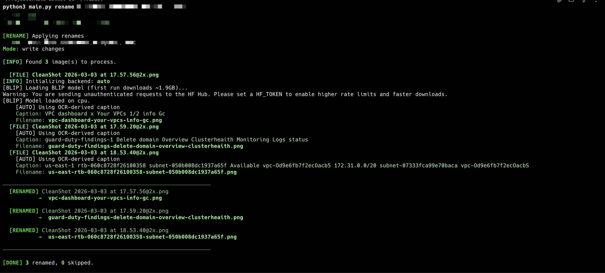

# OCR Screenshot Renamer

Renames screenshots based on visible text and image content. It scans a folder of images and turns generic names into readable filenames like `aws-vpc-route-tables.png`.

---
## NOTE: Currently only works on MacOS/Linux

## Requirements

```bash
pip install pytesseract Pillow
brew install tesseract
```

Optional local vision backends:

```bash
pip install transformers torch accelerate Pillow
```

## Launch

From the project folder:

```bash
cd /path/to/OCR-Screenshot-Renamer
# Two modes are available: scan and rename. Scan previews what the files will be renamed to, while rename executes the action.
python3 main.py scan /path/to/screenshots
python3 main.py rename /path/to/screenshots
```

### Examples

```bash
# Preview renames
python3 main.py scan /path/to/screenshots

# Apply renames
python3 main.py rename /path/to/screenshots
```

## Supported Image Formats

`.png` `.jpg` `.jpeg` `.webp` `.gif` `.bmp` `.tiff`

## Screenshot


